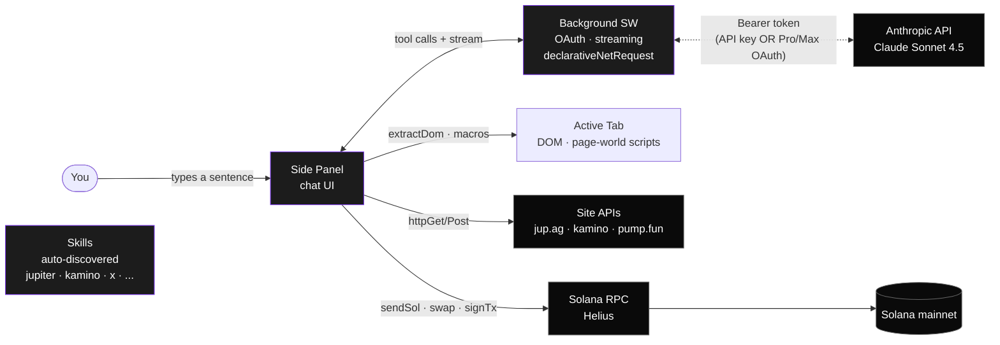
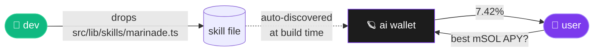

# solana-copilot 🪐

> An AI agent + Solana wallet, in a Chrome side panel.
> Type a sentence — it swaps, tweets, supplies, signs.

```text
me: "swap 0.05 SOL to JUP"
ai: ✓ on-chain

me: "now tweet about it"
ai: ✓ posted
```

---

## It's not a chatbot. It's an agent in your browser.

A chatbot answers questions.
This signs Solana transactions, posts tweets, fills forms — in the same tab you're already browsing.

You type a sentence. The agent picks the right tool (swap, post, lookup, navigate), shows you a preview card, you tap approve once. The action runs. On-chain. In your timeline. Real.

The chat is just the interface. The capability is:

- **A local Solana wallet** — keypair in `chrome.storage`. Sends SOL, swaps via Jupiter, signs arbitrary versioned txns.
- **Reading the actual DOM** of the page you're on. Structured tweets with metrics, Kamino vault tables, Jupiter swap state — extracted clean (no LLM-hallucinating-from-noise).
- **Driving the page** via DOM macros: `xPostTweet` opens compose, fills, clicks submit — one approval, end-to-end.
- **Calling site APIs** directly (Jupiter v6, Kamino, Pump.fun, Solscan, DEX Screener) via per-site skill files.
- **Drop-in extensibility** — `apps/extension/src/lib/skills/<name>.ts`. The loader auto-discovers via `import.meta.glob`. No registry edit.

No backend. No tracking. Open source.

## Architecture



Three planes meet here: **the LLM** (Claude), **the browser** (DOM of whatever you're on), **the chain** (Solana wallet). The extension is the glue.

## How it scales: one file = one site

The interesting part isn't the wallet. It's that **anyone can teach the agent a new site by dropping a file**.



Each skill is a self-contained adapter:

- **Domains it activates on** (`marinade.finance`)
- **API tools** the AI can call when on that site (`marinadeAPY`, `getStakeAccount`)
- **DOM extractor** that reads the page semantically (vault rows, token tiles, tweets)
- **Context-aware suggestions** — chips that adapt to the URL pathname

The loader uses `import.meta.glob('./*.ts', { eager: true })` — no central registry, no PR conflict on a list. Drop, build, reload. The AI now knows that site.

Today: 6 skills shipped (Jupiter, Kamino, X, Pump.fun, DEX Screener, Solscan).
Tomorrow: every Solana site you visit, if someone drops the file.

## Demo

| | |
|---|---|
| `swap 0.5 SOL to BONK` | → Jupiter quote → 1-tap approve → on-chain |
| `tweet "shipping today"` | → AI drafts → 1-tap approve → posted |
| `best USDC yield?` | → Kamino API → ranked vaults |
| `what's @vitalik posting?` | → extractTweets → structured timeline + metrics |
| `summarize this trending coin` | → Pump.fun API → market cap + bonding progress |

All inside the side panel. No tab switching. One side panel, every site.

## Quick start

```bash
git clone https://github.com/onspeedhp/solana-copilot
cd solana-copilot
pnpm install
pnpm --filter extension build
```

Then in Chrome / Arc:

1. `chrome://extensions` → Developer mode → **Load unpacked** → select `apps/extension/dist`
2. Click the extension icon → settings cog → enter:
   - **Wallet:** paste a Solana secret key (or generate fresh)
   - **Cluster:** Mainnet · Custom RPC (Helius recommended)
   - **Claude auth:** API key, or login with your Pro/Max subscription
3. Open any site → start chatting.

## Auth options

You don't need Anthropic API credits if you have a Pro/Max sub.

- **API key** — paste `sk-ant-…`. Pay per request via Console.
- **Subscription (Pro/Max)** — OAuth login *or* import tokens from Claude Code CLI's keychain entry. Routed through the background SW + `declarativeNetRequest` to bypass consumer-account CORS rejection.

## Built-in skills

| Skill | What you can say |
|---|---|
| **Jupiter** | "swap 1 SOL to JUP" · "what's BONK price?" · "best route SOL → USDC" |
| **Kamino** | "best USDC yield" · "my positions" · "compare top 3 vaults" |
| **X / Twitter** | "tweet about X" · "summarize this thread" · "reply 'agreed'" · "like this" |
| **Pump.fun** | "what's trending?" · "tell me about #1 KOTH" · "create a coin" (navigates to /create + fills) |
| **DEX Screener** | "search BONK" · "top SOL pairs" · "is this token legit?" |
| **Solscan** | "what's in this tx?" · "lookup account X" |

Plus wallet-level tools available everywhere: `getBalance`, `getTokenAccounts`, `sendSol`, `getDefiYields`, `httpGet`/`httpPost`, `signAndSendTx`, `pageAction`, `scrollPage`, `navigateTab`.

## Add a new site in one file

Drop `apps/extension/src/lib/skills/<name>.ts`:

```ts
import type { Skill } from './types';

export const skill: Skill = {
  id: 'marinade',
  name: 'Marinade',
  domains: ['marinade.finance'],
  systemPromptHint: 'User is on Marinade — Solana liquid staking.',
  suggestions: [
    { icon: 'trending', text: 'Current mSOL APY' },
    { icon: 'bar-chart', text: 'How much can I unstake?' },
  ],
  tools: [
    {
      isWrite: false,
      schema: {
        name: 'marinadeAPY',
        description: 'Get current mSOL staking APY.',
        input_schema: { type: 'object', properties: {}, required: [] },
      },
      describe: () => 'Marinade APY',
      async execute() {
        const data = await fetch('https://api.marinade.finance/...').then(r => r.json());
        return { apy: data.value };
      },
    },
  ],
  // optional: structured DOM extractor that runs in the page
  extractDom: () => ({ /* ... */ }),
  // optional: URL-aware suggestion chips
  getSuggestionsForUrl: (url) => null,
};
```

Build, reload extension, done. The loader uses `import.meta.glob('./*.ts', { eager: true })` — no registry edit, no central list.

See [`apps/extension/src/lib/skills/_TEMPLATE.ts`](apps/extension/src/lib/skills/_TEMPLATE.ts) and [`apps/extension/src/lib/skills/README.md`](apps/extension/src/lib/skills/README.md) for full contract.

## Architecture

```
apps/extension/
├── manifest.json                          # Chrome MV3
└── src/
    ├── background/index.ts                # OAuth bridge · streaming bridge · dNR header rules
    ├── sidepanel/                         # React side panel UI
    │   ├── App.tsx
    │   ├── hooks/                         # useChat · useActiveTab · useLlmsDiscovery
    │   ├── store/                         # zustand
    │   ├── components/                    # InputBar · MessageBubble · ConfirmActionCard
    │   └── views/                         # HomeView · NoWalletView
    ├── lib/
    │   ├── llm/                           # anthropic · ollama · mock · oauth
    │   ├── tools/                         # wallet-level registry / execute / format
    │   ├── solana/                        # keypair · rpc · sign
    │   ├── skills/                        # auto-discovered site adapters
    │   └── dom-bridge.ts                  # page-world DOM macros (xPostTweet, etc.)
    └── types/index.ts
```

## What's hard, what's easy

**Easy with this approach:**

- Reading semantic HTML sites (data-testid, aria-label).
- API-backed sites (Solscan, DEX Screener, Pump.fun frontend API).
- Drop-in supporting any site you visit daily.

**Hard / out of scope:**

- **Canvas-rendered apps** (Google Sheets, Docs, Figma, Excel Online). The grid is pixels in `<canvas>`, not DOM cells. Workaround = official APIs + OAuth. Not built here.
- **Heavily obfuscated sites** with rotating class names. Skills target stable landmarks; expect some rot over time.
- **Production-grade key custody.** Local keypair, no hardware wallet integration, no Wallet Adapter. Side project scope.

## Caveats

- Claude.ai OAuth flow reuses Claude Code's public client_id. Anthropic doesn't officially endorse third-party use — could be revoked.
- The X post-tweet macro inserts via `execCommand` + line-by-line paragraph breaks. Works on x.com today; X frontend evolves.
- No backend proxy, so API keys are bundled in the extension. Use a demo wallet, not your main one.

## Why I built this

Browser extensions = the right form factor for AI agents. Side panel sees your context (current page, tab history, scroll position). Wallets need to live where you trade and tweet.

Existing wallets are dumb (just sign things). Existing AI chats don't see your browser. This bridges them — for Solana specifically, where the API surface is rich and the user culture is on-chain-by-default.

## Stack

- Chrome MV3 + Vite + `@crxjs/vite-plugin`
- React 18 + Tailwind + Zustand
- TypeScript strict
- Claude Sonnet 4.5 (API or OAuth via Pro/Max)
- Solana web3.js · Jupiter v6 · Helius RPC

## License

MIT. Use it, fork it, ship it.

## Contributing

Skills welcome. Open a PR adding `apps/extension/src/lib/skills/<yoursite>.ts`. The loader picks it up. See the contributor README in that folder.
